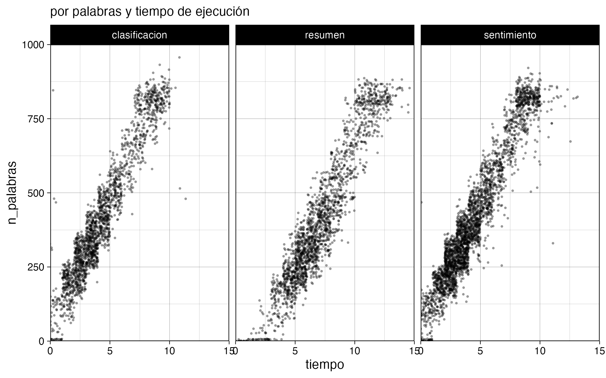
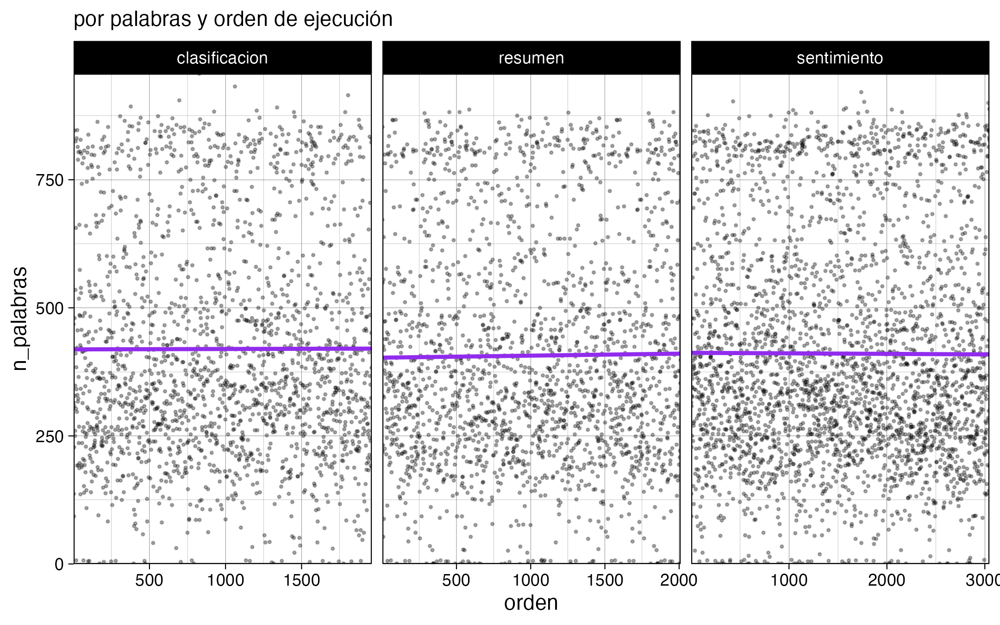

Anoche dejé el computador procesando 5000 noticias por 8 horas usando un modelo de lenguaje (LLM) local en R para obtener clasificación, resumen y sentimiento de cada texto. 

Esto porque tengo una [base de datos de más de 600 mil noticias chilenas](https://github.com/bastianolea/prensa_chile), con su texto completo, y quiero empezar a sacarle más provecho. Por ejemplo, saber si noticias que hablan de ciertos temas son positivas o negativas (sentimiento), o simplemente clasificar de manera automatizada las noticias para separar las de política y economía de las de deportes y farándula.

Para la inferencia usé el modelo Llama 3.1 de 8B, a través de Ollama y el paquete de R [{mall}](https://mlverse.github.io/mall/). Hice [un script para cada tipo de inferencia](https://github.com/bastianolea/prensa_chile/tree/main/procesamiento), y están estructurados para cargar los resultados existentes de su mismo proceso, excluir los textos que ya fueron procesados, y empezar a procesar una muestra aleatoria de una cierta cantidad de nuevos textos. La cantidad aleatoria está definida por el tiempo estimado que va a tomar en procesarlas. Se demora aproximadamente una hora en procesar 1000 noticias, pero esto depende de qué tanto texto tenga la noticia, y del tipo de inferencia que se está realizando; por ejemplo, los resúmenes de texto tardan más que el análisis de sentimiento.

El proceso en sí mismo se ve más o menos así:

```r
sentimientos <- map(datos_limpios_split, 
                    \(dato) {
                      inicio <- now()
                      message(paste("procesando", dato$id))
                      
                      # obtener sentimiento
                      sentimiento <- dato$texto |> llm_vec_sentiment(options = c("positivo", "neutral", "negativo"))
                      
                      # reintentar 1 vez
                      if (is.na(sentimiento)) {
                        sentimiento <- dato$texto |> llm_vec_sentiment(options = c("positivo", "neutral", "negativo"))
                      }
                      final <- now()
                      
                      if (is.na(sentimiento)) return(NULL)
                      
                      # resultado
                      resultado <- tibble(id = dato$id,
                                          sentimiento,
                                          tiempo = final - inicio,
                                          n_palabras = dato$n_palabras
                      )
                      
                      return(resultado)
                    }); beep()
```

Se trata de un loop a partir de una lista de dataframes de una fila, cada elemento de la lista conteniendo los datos de cada noticia. Dentro de la alteración se extrae el sentimiento, se clasifica o se genera un resumen con una función del paquete {mall}. Luego, en caso de que la inferencia haya fallado (los modelos de lenguaje no son deterministas, por lo que pueden falla la tarea o entregar resultados inesperados de vez en cuando), se reintenta una vez, y al final se entregan los resultados con una variable que representa el tiempo que tardó el procesamiento.

También hice gráficos para monitorear el avance, y si bien no es rápido (4 segundos promedio por noticia), confirmé que el computador no se sobrecalienta (tuvo un desempeño parejo luego de 8 horas). También se nota cómo los textos más largos tardan más en obtener resultados. 






Digo que el computador no se sobrecalienta, porque tengo un MacBook Air M3, que si bien tiene un GPU poderoso, no tiene ventiladores 😰 así que tuve miedo de que el desempeño bajara por la temperatura. Mi solución: dejarlo frente a un ventilador 😂

<div style = "max-width: 300px; margin: auto;">


</div>

Voy a dejarlo unas noches más procesando, y con estos nuevos datos voy a poder actualizar mi [aplicación de análisis de prensa](https://github.com/bastianolea/prensa_chile) para ponerle cosas más interesantes 🥰