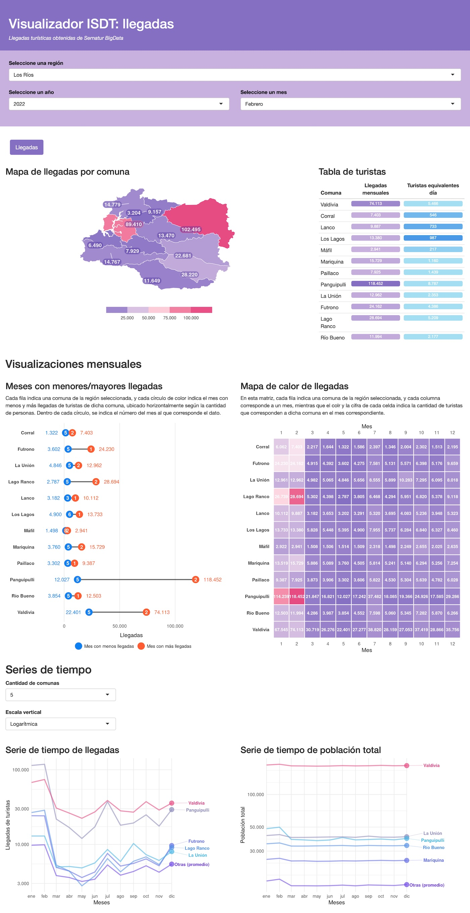
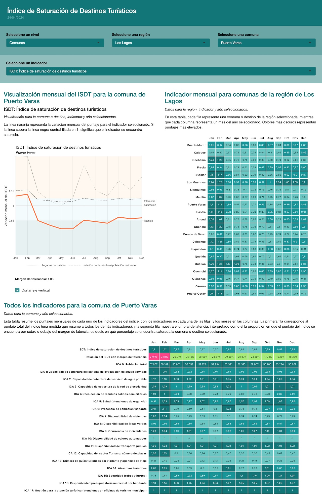
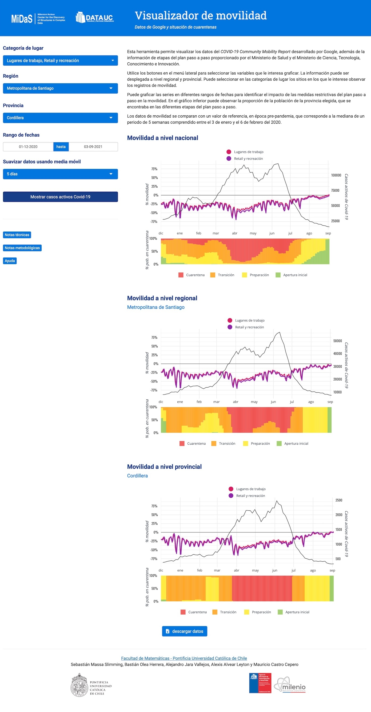
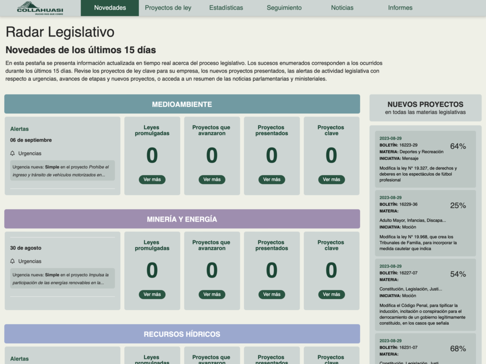
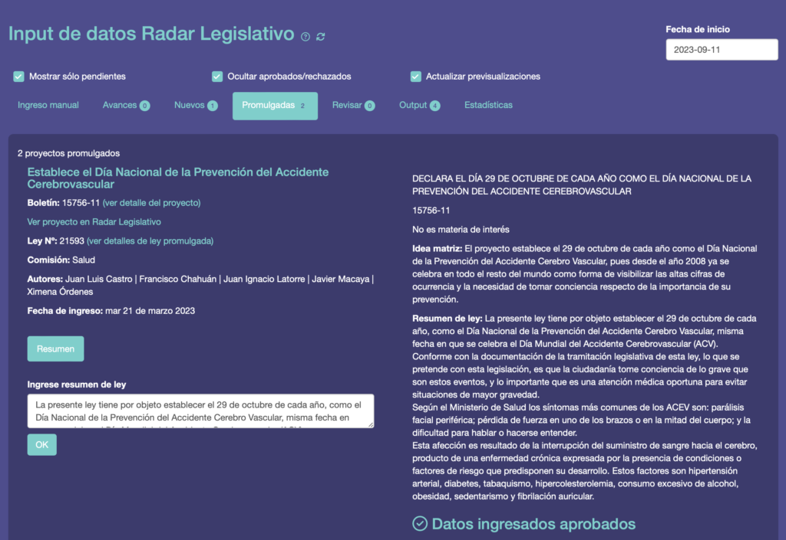
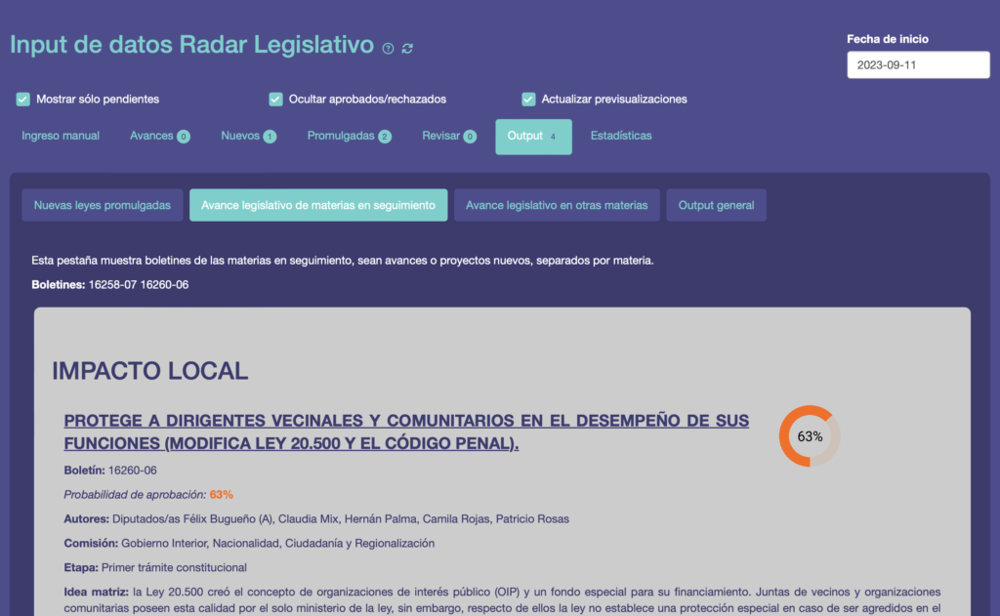
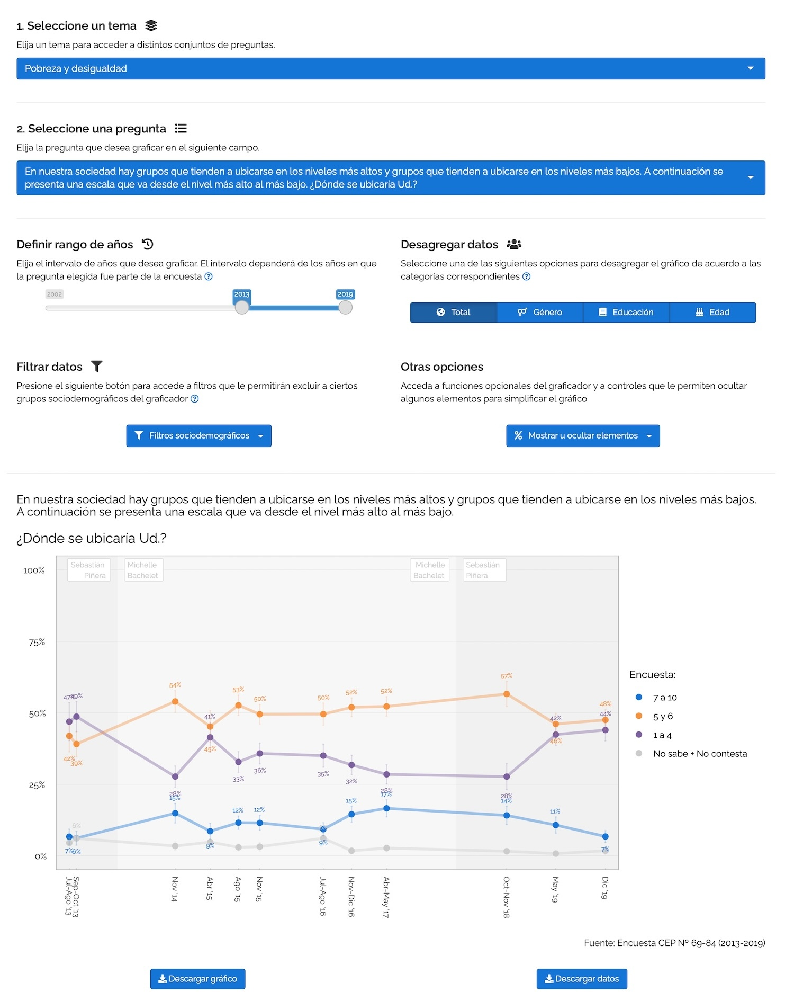
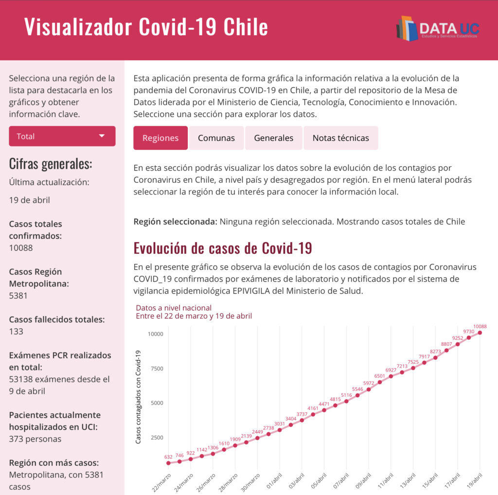
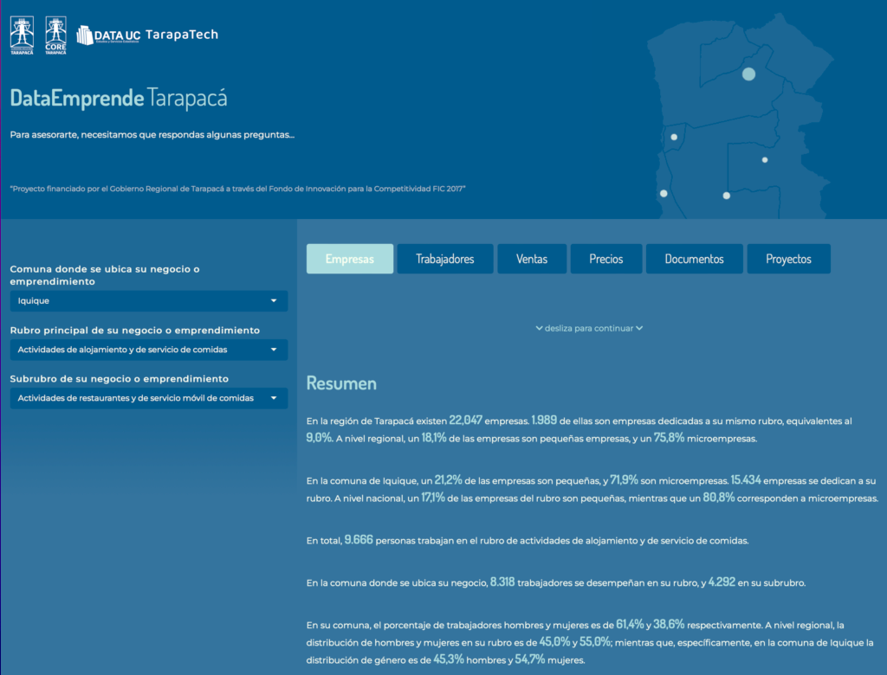

En esta página mantengo muestras de algunos proyectos que he realizado como analista de datos y desarrollador de R, y que consisten principalmente en aplicaciones web para la visualización y exploración de datos usando el [lenguaje de programación R](/blog/r_introduccion/), la [suite de paquetes para ciencia de datos Tidyverse](/tags/dplyr/), y el paquete de [desarrollo de aplicaciones web Shiny](/tags/shiny/).

Todo lo descrito ha sido programado íntegramente por mi, como parte de distintos equipos de trabajo.

----

## Visualizador de resultados de encuesta de opinión sobre China
_Núcleo Milenio sobre los Impactos de China en América Latina_

Desarrollo de una aplicación web que visualiza los resultados de la _Encuesta de opinión pública: ¿Qué piensan los chilenos sobre China?,_ para el [Núcleo Milenio sobre los Impactos de China en América Latina (ICLAC)](https://iclac.cl/).

La aplicación entrega más de 20 gráficos con distintos elementos de interactividad para presentar los resultados principales de la encuesta, y en la parte inferior de la página se encuentra un visualizador personalizado donde las y los usuarios pueden elegir cualquier pregunta de la encuesta y aplicarle filtros, desagregación, cruces de variables, visualización histórica, y más.

El sistema está diseñado para recibir nuevas encuestas que se agregan al visualizador existente sin problemas, mediante un proceso de limpieza y procesamiento de los datos automatizado.

_Nota: en la imagen se ve el visualizador en dos columnas, dado que es muy largo_

Puedes [acceder al visualizador de la encuesta aquí.](https://iclac.cl/monitor-de-opinion-publica/)

----

## Índice de Saturación de Destinos Turísticos
_Pontificia Universidad Católica de Chile_

_Reporte automatizado en R y Quarto con gráficos ggplot2._

Programación de sistemas automatizados de obtención y procesamiento de datos, motor de cálculo estadístico para todas las comunas y destinos turísticos del país, visualizaciones interactivas de datos, reportes automatizados, coordinación de diseño y programación de plataforma web.

Proyecto FONDEF Índice de Saturación de Destinos Turísticos. Programación de sistemas automatizados de obtención y procesamiento de datos, motor de cálculo estadístico para todas las comunas y destinos turísticos del país, visualizaciones interactivas de datos, reportes automatizados, coordinación de diseño y programación de plataforma web.

----

## Índice de movilidad Google Chile
_DataUC_ (Facultad de Matemáticas PUC), Pontificia Universidad Católica de Chile

Desarrollo de una plataforma de visualización de datos que accedía a los datos periódicamente actualizados de movilidad de Google, para visualizar la información aplicada a Chile, por región y provincia. Además, relacionaba estos datos con los datos en tiempo real de coronavirus en Chile, junto a la información sobre el estado de cuarentena de las comunas correspondientes.

_Aplicaciones web desarrolladas con R y Shiny con gráficos ggplot2_

----

## Radar Legislativo
_Consultora Desplegar_

Análisis de datos, desarrollo de índices e indicadores, automatización de web scraping, desarrollo de aplicaciones web de visualización de datos para la toma de decisiones empresariales. Estas aplicaciones web se alimentan por un conjunto de sistemas automatizados de obtención y procesamiento de datos, que además de entregar datos en tiempo real, permite enriquecerlos por medio de aplicaciones de uso interno.

_Aplicación web desarrollada con R y Shiny, en base a web scraping en R usando rvest, procesamientos automatizados de datos, y algoritmos de predicción, y una API en plumber_

_Aplicación web desarrollada con R y Shiny con gráficos ggplot2_

----

## Índice de movilidad Transbank
_DataUC_ (Facultad de Matemáticas PUC), Pontificia Universidad Católica de Chile

_Aplicaciones web desarrolladas con R y Shiny con gráficos ggplot2_

Plataforma de visualización de datos que producía un índice de movilidad a partir del procesamiento algorítmico de cientos de millones de observaciones correspondientes a las transacciones de tarjetas de débito y crédito Transbank. Los datos de transacciones eran preprocesados con algoritmos de anonimización de datos.

----

## Graficador Centro de Estudios Públicos (CEP)
_Centro de Estudios Públicos_

Desarrollo de un sistema de procesamiento de encuestas con muestreo complejo en R, además de una [plataforma de visualización interactiva de datos históricos de las encuestas del Centro de Estudios Públicos (Graficador CEP)](/apps/cep_graficador/), utilizando R para el procesamiento de datos, y R+Shiny para la aplicación web.

_[Aplicación web](/apps/cep_graficador/) desarrollada con R y Shiny con gráficos ggplot2, alimentada por datos de encuestas procesados en R usando tidyverse y el paquete survey_

----

## Tarapacá intelligence
_DataUC_ (Facultad de Matemáticas PUC), Pontificia Universidad Católica de Chile
Recopilación, limpieza y análisis de datos estadísticos de relevancia social.

_Visualizaciones de datos en R usando ggplot2, a partir de datos sociales procesados con R_

----

## Índice de Perfilamiento Social
_Consultora Desplegar_

Aplicación web desarrollada con R y Shiny a partir del cálculo de un índice estadístico a nivel comunal

----

## Visualizador Covid 19 Chile
_DataUC_ (Facultad de Matemáticas PUC), Pontificia Universidad Católica de Chile

Análisis y visualización de datos utilizando el lenguaje de programación estadística R. Obtención automatizada de datos web (web scraping). Desarrollo de plataformas web interactivas de visualización de datos con R Shiny.

_Aplicación web desarrollada con R y Shiny con gráficos ggplot2, además de una API en plumber_

----

## DataEmprende
_DataUC_ (Facultad de Matemáticas PUC), Pontificia Universidad Católica de Chile

_Aplicación web desarrollada con R y Shiny con gráficos ggplot2_

