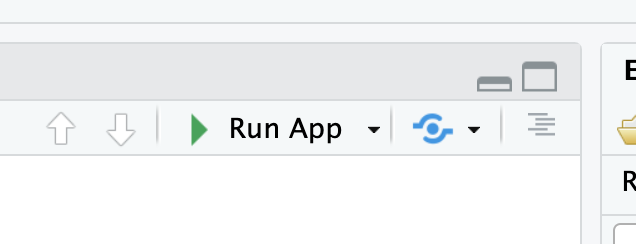
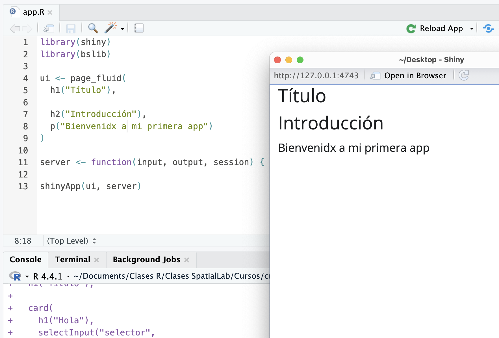
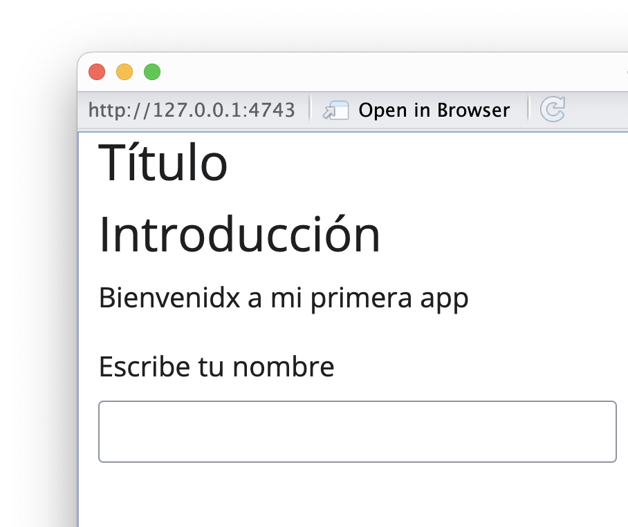

Shiny es un paquete de R que permite crear aplicaciones web interactivas usando sólo código de R. Es muy fácil de aprender, puedes crear cosas interesantes en muy poco tiempo, y tiene la capacidad de [crear complejas y atractivas aplicaciones.](/apps/) 

En este tutorial introductorio aprenderás cómo crear una app Shiny básica, que incluya texto, interacción para el usuario, y un resultado a partir de la interacción.

### ¿Por qué usar Shiny?

- _Control del stack completo de la aplicación desde un mismo lenguaje:_
  - Sólo necesitas aprender un lenguaje para poder hacer una aplicación completa: desde el procesamiento de los datos a la apariencia visual de tu aplicación, pasando por la interactividad, los gráficos y más.
- _Reutilización del código de R:_
  - Como todo está programado con R, puedes usar el códido que usas en otros proyectos o scripts para hacer tus gráficos, cálculos, estadísticos y tablas en tu aplicación Shiny.
- Reducido tiempo de desarrollo para usuarios que no tienen un trasfondo de informática
- Flexibilidad a la hora de publicar la aplicación en un servicio o servidor
- Ecosistema de paquetes de R que se integra perfectamente en el desarrollo de Shiny


## Elementos de una app Shiny

Para entender cómo funciona una aplicación Shiny, debemos saber que una app se crea en un script usualmente llamado `app.R`, el cual se subdivide en dos partes principales: `ui` y `server`.

### UI: interfaz gráfica e interacción
- Interfaz de la aplicación
- Disposición de los elementos en la app: botones, texto, títulos
- Creación de los inputs de la app (botones, sliders, etc.)
- Establecimiento temas y de estilos CSS
- Disposición de los outputs de una app: gráficos, tablas, y otros elementos que se renderizan desde R

### Server: cálculos y salidas
- Aspectos computacionales de la aplicación
- Definición de objetos reactivos, que se re-evalúan al cambiar un input u otro reactivo
- Observadores que realizan cómputos en base a inputs u otros reactivos
- Renderización de gráficos y tablas, y salida de los mismos como outputs

Entendiendo ésto, podemos crear nuestra propia aplicación.

## Creando una aplicación Shiny mínima

### Crea un nuevo proyecto
Primero, como en cualquier otra instancia de desarrollo con R, debes crear un nuevo proyecto, dentro del cual tengas todos los scripts y datos que se vayan a utilizar en tu aplicación.

En el menú _File,_ elige _New Project_ y crea un proyecto en una nueva carpeta, con el título de tu aplicación.


### Crear el script 

En RStudio, crea un nuevo script titulado `app.R`. Lo primero que vamos a poner en este script vacío, va a ser la carga del paquete `{shiny}` y del paquete `{bslib}` (que nos ayuda a construir aplicaciones más atractivas).

```
library(shiny)
library(bslib)
```

#### Interfaz básica
El segundo paso será crear una interfaz visual para nuestra aplicación que esté vacía. 

En esta interfaz es donde pondremos los títulos, textos, y botones de nuestra aplicación, y también donde posicionaremos las salidas o _outputs_ de nuestra aplicación, tales como gráficos, tablas, y más.

Para empezar, la `ui` de nuestra app se crea con una función que empiece con `page_`, como `page_fluid()`:

```r
ui <- page_fluid()
```

Esa sería una aplicación vacía, sin nada en ella. Podemos agregar los primeros contenidos usado nuestras primeras funciones para crear textos:
- `h1()`: un título
- `h2()`: un subtítulo
- `p()`: un párrafo de texto normal

```r
ui <- page_fluid(
  h1("Título"),
  
  h2("Introducción"),
  p("Bienvenidx a mi primera app")
  )
```

#### Server provisorio
Para poder previsualizar nuestra aplicación, tenemos que tener una `ui` y un `server`, así que crearemos un `server` básico, que no haga nada por ahora.

`server` es una función de R que contiene los argumentos `input`, `output` y `session`. Serán importantes más adelante, pero por ahora, solamente definimos esta función en nuestro script y la dejamos ahí.

```r
server <- function(input, output, session) { }
```

### Ejecutar aplicación
El último paso será unir ambos aspectos de nuestra aplicación, para poder ejecutarla. Esto se hace al final del script:

```r
shinyApp(ui, server)
```

Al incluir esta línea en nuestro script, RStudio detectará que se trata de una aplicación, y ofrecerá un nuevo botón en la parte superior derecha del panel de scripts: el botón para ejecutar la app (_Run App_).

<div style="text-align: center; margin:auto; max-width: 400px;">



</div>

Pero antes, revisemos la totalidad de nuestro (breve) script hasta el momento:

```r
library(shiny)
library(bslib)

ui <- page_fluid(
  h1("Título"),
  
  h2("Introducción"),
  p("Bienvenidx a mi primera app")
)

server <- function(input, output, session) { }

shinyApp(ui, server)
```

Tenemos un script que carga los paquetes que usamos, crea una interfaz (`ui`), define un servidor (`server`), y une ambos al final para poder ejecutarla. Presiona el botón _Run App_ y tu aplicación Shiny debería abrirse en una nueva ventana y mostrarse. ¡Lo logramos!



----

## Crear una aplicación Shiny básica

A continuación aprenderemos a agregar los primeros _inputs_ y _outputs_ a nuestra aplicación.

### Inputs

Los _inputs_ son todos los elementos visuales e interactivos que podemos poner en una aplicación, y que permiten que un usuario o usuario interactúe con nuestra aplicación, y a su vez, con el código que la compone. 

Pueden ser elementos tales como selectores, botones, sliders, y otros. Shiny ofrece una amplia variedad de inputs a nuestra disposición, pero también hay otros paquetes de R que nos entregan más inputs.

Para agregar un input a tu aplicación, debes definirlo en la sección `ui` de la app:

```r
ui <- page_fluid(
  h1("Título"),
  
  h2("Introducción"),
  p("Bienvenidx a mi primera app"),
  
  # agregar un input
  textInput("nombre", 
            label = "Escribe tu nombre")
  )
```

Aquí agregamos un `textInput()`, un input que permite al usuario o usuaria escribir el texto que desee. 

Los inputs tienen <ins>siempre</ins> como primer argumento su _nombre interno._ Este nombre interno debe ser único, y es el que se usará más adelante en `server` para referirnos al contenido de la selección del usuario/a. 

Como segundo argumento, usualmente hay que poner la _etiqueta_ del input, que es el texto que el usuario verá inmediatamente antes del input, que le entrega instrucciones sobre qué debe o puede hacer con él.

Luego de agregar el input al `ui` de tu app, puedes volver a ejecutarla para ver cómo va quedando. 

<div style="text-align: center; margin:auto; max-width: 500px;">



</div>


### Server 
Por ahora, el input que creamos no hace nada. Para hacer que haga algo, hay que usarlo en `server`.

Crearemos un objeto dentro del `server` que recibirá el contenido del `input.` que acabamos de crear. Pero este objeto será un objeto especial, porque es creado con la función `reactive()`, que crea un _objeto reactivo._ 

#### Reactividad
Los objetos reactivos son la pieza fundamental de Shiny: son objetos de R que tienen una característica especial: cuando _cambia_ uno de los elementos que se usan dentro del objeto, o que se usan para construir el objeto, el objeto reactivo _se actualiza._ 

En otras palabras, es como si crearas un objeto de R que se va a actualizar automáticamente si es que uno de los elementos que se usan para calcular el objeto cambian en su valor.

_Por ejemplo:_ 
```r
numero_a = 4
numero_b = 8

resultado = numero_a + numero_b
```

En este ejemplo, se usan dos objetos para calcular un tercer objeto, `resultado`. En una sesión normal de R, si cambiamos el valor de `numero_a`, tenemos que volver a ejecutar, manualmente, `numero_a` y `resultado = numero_a + numero_b` para poder obtener el nuevo valor de `resultado`.

Pero en Shiny, este tipo de actualizaciones de los valores ocurren automáticamente, siempre y cuando se realicen rentro de la función `reactive()`. Así, cuando el usuario cambie `numero_a` o `numero_b`, el valor de `resultado` se actualizará automáticamente.

De esta forma, los cálculos que hagamos en Shiny se van a actualizar siempre que el usuario o usuario haga cambios en los inputs que afectan al objeto. 

Definamos nuestro primero objeto reactivo dentro de `server`:

```r
server <- function(input, output, session) {
  
  # crear un objeto reactivo
  texto <- reactive({
    # aquí irá el cálculo
  })
}
```

Ahora, dentro del `reactive()`, pondremos una operación básica de R que haga uso del input que habíamos creado:

Dentro de un `reactive()`, podemos hacer cualquier operación o secuencia de operaciones con R que queramos, usando los paquetes de R que necesitemos. Para mantener este tutorial sencillo, usaremos la función `paste()`, que une dos o mas piezas de texto, separadas por un espacio.

```r
# crear un objeto reactivo
texto <- reactive({
  paste("Hola", input$nombre) # pegar el contenido del input con otro texto
})
```

De este modo, cuando el input cambie, se recalculará el objeto reactivo `texto`, y se actualizará su resultado para reflejar el cambio en el input.

Pero aún falta un paso para poder ver el resultado! 😱

#### Outputs

Para poder ver el resultado, tenemos que crear una _salida_ o `output`. Los _outputs_ toman el resultado de los cálculos realizados en `server`, y se los hacen llegar a la parte visual de nuestra aplicación, la `ui`.

Creamos un output que grafique o _renderice_ el cálculo en un resultado visible:

```r
output$texto <- renderText({
    texto()
})
```

Lo que hará este bloque es tomar el objeto reactivo `texto()` (que al ser reactivo debe llamarse como si fuera una función, con `()` al final), renderizarlo como texto (con `rendertext()`), y asignarlo a una _salida_ llamada `"texto"` (`output$texto`).

Confirmemos cómo va quedando nuestra sección `server` en su totalidad:

```r
server <- function(input, output, session) {
  
  # crear un objeto reactivo
  texto <- reactive({
    paste("Hola", input$nombre) # pegar el contenido del input con otro texto
  })
  
  # output del objeto reactivo
  output$texto <- renderText({
    texto()
  })
}
```

### Conectar `server` con `ui`

El último paso es poner en algún lugar de nuestra `ui` el _output_ que acabamos de crear. Simplemente agregamos `textOutput("texto")` en el lugar de nuestra `ui` que elijamos:

```r
ui <- page_fluid(
  h1("Título"),
  
  h2("Introducción"),
  p("Bienvenidx a mi primera app"),
  
  textInput("nombre", 
            label = "Escribe tu nombre"),
  hr(),
  
  # salida desde server
  textOutput("texto") 
)
```

Además, entre el _input_ y el _output_ pusimos una línea separadora con `hr()`. Si ahora ejecutas la aplicación, podrás ver que el texto de abajo refleja lo que escribas en el input de arriba.

Ahora que vimos lo básico de una app Shiny, podemos complejizar el ejemplo agregando otro input:

```r
selectInput("saludo",
              label = "Elije un saludo",
              choices = c("Hola", 
                          "Chao", 
                          "Te odio" = "Hasta nunca,")),
```

Agregamos un _selector_ que permite elegir entre varias opciones. Una de ellas tiene un nombre y un valor (`"Te odio" = "Hasta nunca,"`), porque el usuario verá el _nombre_ en el selector (_Te odio_), pero internamente el input entregará el _valor_ (`"Hasta nunca,"`).

Modificamos el objeto reactivo para que ahora use los dos inputs:

```r
texto <- reactive({
    # paste("Hola", input$nombre) # pegar el contenido del input con otro texto
    paste(input$saludo, input$nombre) # pegar los dos inputs
  })
```

Ejecutamos la app, y vemos que ahora tenemos dos inputs, los cuales se usan en un mismo objeto reactivo, el cual se actualiza cuando cualquiera de los dos inputs cambia.

<div style="text-align: center; margin:auto; max-width: 560px;">


</div>


¡Listo! 🥳 Tienes una app Shiny básica con inputs, reactividad y outputs. Puedes encontrar todo el [código de la aplicación de este tutorial en este enlace.](https://github.com/bastianolea/blog-r/blob/master/content/blog/r_introduccion/tutorial_shiny_1/app.R)

El siguiente paso es compartirla con los demás! Para eso, puedes seguir el tutorial [publicar una app Shiny en shinyapps.io](/blog/r_introduccion/tutorial_shinyapps/), y en unos minutos podrás subir tu aplicación Shiny a internet, gratis.

----

Si tienes cualquier consulta, necesitas apoyo con tu aplicación Shiny, o deseas que te ayude a desarrollar un proyecto, no dudes en [contactarme](/contact/).

[Revisa mis clases para ver los cursos anteriores de Shiny](/clases/) que he impartido, los cuales contienen código y ejemplos de aplicaciones.