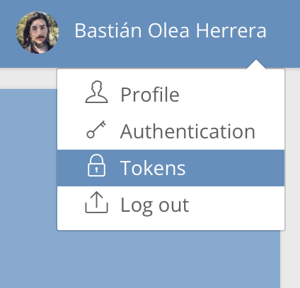
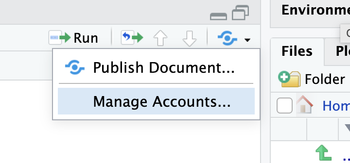
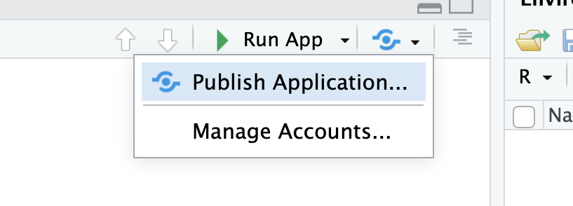
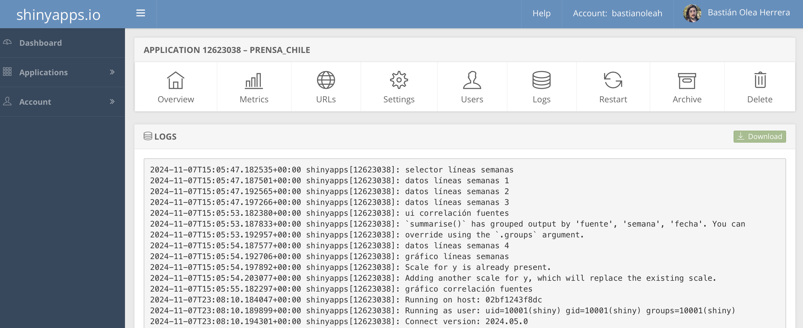

¿Desarrollaste una aplicación con Shiny, y quieres compartirla con el mundo? [shinyapps.io](https://www.shinyapps.io) es, en mi experiencia, el servicio más sencillo de usar para poder hacer públicas tus aplicaciones Shiny.

El primer paso es, lógicamente, tener una app Shiny funcionando. Para asegurarte que tu app funcione sin problemas, acá van soluciones a los errores más frecuentes de las apps Shiny:
- Asegúrate de que tus scripts (`app.R`, o bien, `ui.R` y `server.R`) estén todos dentro de una misma carpeta
- Confirma que los datos que cargue tu app estén en la misma carpeta que tu script, o bien, entro de carpetas que estén al mismo nivel que tus scripts. En otras palabras, si tu app carga datos, las rutas `deberían/ser/así.csv` o `así.rds`, y no `~/users/tu/documents/cosas/app/datos.xlsx` ni tampoco `C:\Users\Desktop\app\datos\data.csv`.
- Reinicia tu sesión de R (Session > Restart R) y confirma que tu aplicación funciona correctamente. Así confirmas que tu app carga todos los paquetes necesarios, y que no depende de algo que estaba en tu entorno de R pero que no era reproducible desde su código.

Luego, debes crearte una cuenta en [shinyapps.io](https://www.shinyapps.io). Las cuentas gratuitas permiten tener hasta 5 aplicaciones, con 25 horas de uso mensual (en total, entre todos tus usuarios). Ésto es más que suficiente para apps de pruebas y con pocos usuarios, considerando que al superar el límite de horas no te interrumpen imnediatamente el acceso a tu aplicación. El plan inicial (13USD) permite 25 aplicaciones y 1000 horas de uso mensual.


Después, en tu sesión de R, debes instalar el paquete `{rsconnect}`, que permite la conexión entre R y el servicio:

```
install.packages('rsconnect')
```

## Conectar tu cuenta a RStudio
Una vez que tengas tu cuenta y R preparado, debes autorizar tu cuenta de shinyapps.io en RStudio, para que tu cuenta quede guardada en RStudio y así puedas subir cosas. Para ello, ShinyApps te entrega un código secreto asociado a tu cuenta, el cual debes registrar en tu sesión de R.


Al crear tu cuenta, el sitio te explica ésto, y te entrega un bloque de código similar al que pongo a continuación. Al ejecutar ese código en tu sesión de R, registra tu cuenta de shinyapps.io con tu computadora.

```
rsconnect::setAccountInfo(name=‘cuenta’,
			  token=‘<TOKEN>,
			  secret='<SECRET>')
```

Si ya tienes tu cuenta, pero necesitas conectarla con RStudio, en el menú superior del sitio puedes entrar a _Tokens_ y crear una nueva llave. 



Ahí creas una nueva llave, y puedes realizar el proceso de enlazamiento de tu cuenta con RStudio desde RStudio: en el botón azul _publicar_ en la esquina superior derecha de tu panel de scripts de RStudio, y presiona _Manage Accounts,_ o bien, abre las opciones globales de RStudio (menú Tools > Global Options) y entra al panel _Publishing._



Dentro del menú que se abre, elige el botón _Connect_ para agregar una cuenta nueva, y pegas el bloque de código con tu _token_ y _secret._


## Publicar una aplicación

Una vez realizados los pasos anteriores podrás subir tus aplicaciones. Cuando abras un script de una app Shiny, verás el botón azul de _publicar_ al lado del botón _Run App._ En este botón eliges _Publish Application_ para empezar el proceso de subir tu aplicación local a shinyapps.io.



En la ventana que se abre, debes seleccionar los scripts y archivos que se requieren para que tu aplicación funcione. Puedes des-seleccionar los que no sean cruciales para el funcionamiento de la app. Luego le das un nombre a tu splicación (que será parte del enlace que la gente usará para acceder a tu app, así que elige bien), y presionas _Publish._


Se abrirá un panel nuevo en tu panel de consola, titulado _Deploy,_ donde se indicará el avance de la construcción de tu aplicación. Dependiendo de la cantidad de paquetes que uses, se demorará más o menos en generar el entorno de tu aplicación. Finalmente, el mismo panel te entregará el enlace a tu aplicación, y si seleccionaste la opción en el paso anterior, tu app se abrirá en tu navegador web. ¡Listo! Tu app fue publicada en los servidores de shinyapps.io, y ya está lista para ser compartida.


## Solución de problemas
Si tu aplicación remota (la versión que acabas de publicar) no se ejecuta, o arroja errores, puedes entrar a tu perfil en shinyapps.io, elegir la aplicación, y revisar los registros (logs) de tu aplicación para ver lo que dicen los errores. Usualmente puede ocurrir porque faltó cargar un paquete, o una ruta estaba mal especificada.



En el panel de logs también puedes ver los mensajes que tu aplicación emite, lo que puede ayudarte a detectar problemas.