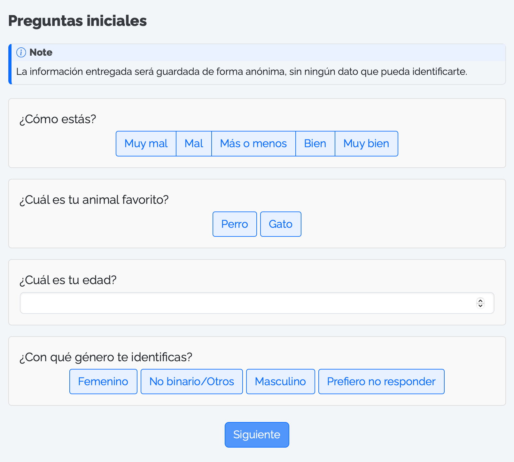
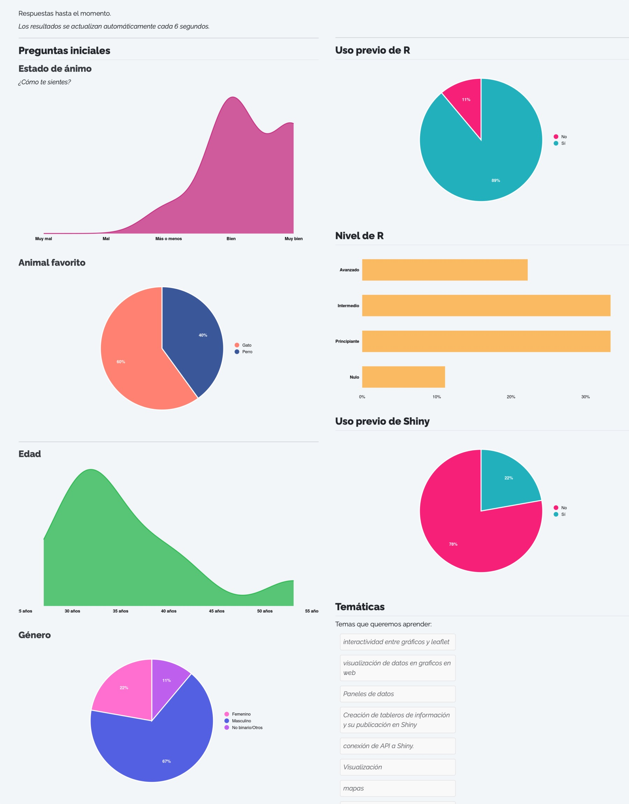

Con el paquete [`{surveydown}`](https://surveydown.org) es muy fácil crear una encuesta con R, creando tus propias preguntas personalizadas, y almacenando todas las respuestas de tus encuestados/as en una base de datos.

La gracia de crear tu propia encuesta es que puedes personalizarla según tus necesidades, pero también es que no necesitas depender de un servicio para generar la encuesta, ni tampoco tener que pagar para poder crearla o publicarla. Por el contrario, podemos utilizar tecnologías gratuitas y de código abierto para crear nuestras encuestas, almacenar sus resultados y analizarlos.

El paquete [`{surveydown}`](https://surveydown.org) combina el uso de [Quarto](https://quarto.org/docs/computations/r.html) y [Shiny](https://shiny.posit.co/r/getstarted/shiny-basics/lesson1/) para crear encuestas fáciles de diseñar, y con altas capacidades de personalización.

El diseño de la encuesta, con todas sus preguntas, títulos, textos, páginas y botones, se hace por medio de un **documento [Quarto](https://quarto.org/docs/computations/r.html)**, donde literalmente vas poniendo todo el contenido que quieres que tenga tu encuesta, especificando los saltos de página de la encuesta, y listo.

El funcionamiento interno de la encuesta es resuelto por `{surveydown}`, y no tenemos que realizar nada de configuración ni programación por nuestro lado. Todo funciona de forma inmediata (la encuesta, la interacción del usuario y la base de datos) por medio de una **aplicación Shiny**. Lo único que tenemos que proveer es la **conexión a la base de datos** donde se van a ir guardando las respuestas, y de la cual también vamos a poder obtener los resultados cuando queramos.

<div style="padding:18px;padding-bottom:1px;padding-top:1px;background-color:#493365;color:#E9DDEE;border-radius:6px;margin:20px;margin-top:40px;margin-left:40px;margin-right:40px;font-size:100%;">

Aquí les dejo una encuesta de prueba, hecha siguiendo este tutorial, para ver quién gana: ¿gatos 🐈 o perros 🐕? [**Responde aquí**](https://bastianoleah.shinyapps.io/encuesta_animales)

</div>

<br></br>


## Crear una encuesta

Para crear nuestra encuesta, podemos usar la función `surveydown::sd_create_survey("ruta/de/la/encuesta/")` para que el paquete `{surveydown}` cree un nuevo proyecto de R con una plantilla de encuesta lista para editar.

Otra alternativa es clonar[^1] una [encuesta de demostración disponible la página de `{surveydown}`](https://surveydown.org/demos). El beneficio de esta alternativa es que puedes probar la encuesta antes, para ver cómo quedaría, y si te sirve, la clonas en tu equipo para poder editarla.

[^1]: Para clonar un repositorio de GitHub, entras al repositorio, presionas el botón verde que dice _Code_, copias el enlace que te entrega, y en RStudio creas un nuevo proyecto a partir de control de versiones, pegas ahí el enlace del repositorio GitHub, y específicas donde quieres guardar tu proyecto clonado.


Cuando creamos nuestra primera encuesta, obtenemos un proyecto de R con dos archivos principales: 
- `survey.qmd`: la encuesta, en un documento Quarto, donde diseñas todo el contenido de la encuesta, desde subtítulos, textos de introducción, títulos para las preguntas, las preguntas en sí misma, y otros textos que quieras agregar entremedio de la encuesta.
- `app.R`: la aplicación Shiny donde va a aparecer tu encuesta, y que posibilita que las respuestas vayan guardándose en una base de datos. En esta aplicación de Shiny no hay mucho que hacer, porque todo el contenido visible y usable de la encuesta está en el documento Quarto `survey.qmd`. El rol de la aplicación Shiny es hacer la gestión de que la encuesta funcione y sea interactiva, y que las respuestas que ingresamos quedan registradas en la base de datos. Pero también, al ser una aplicación Shiny, podemos hacer cosas avanzadas con nuestra encuesta, como por ejemplo ir mostrando resultados en tiempo real, visualizaciones de nuestros resultados que se actualizan automáticamente, y más.

 

## Diseñar la encuesta

Estando en el proyecto de R de nuestra nueva encuesta, abrimos el documento Quarto `survey.qmd`, y en él encontraremos una encuesta que viene por defecto. 

Mirando este documento vemos que las páginas de la encuesta van delimitadas por cercos `:::`, y que dentro de estos cercos va todo el contenido que queramos poner en cada página, como títulos, textos y preguntas.

```quarto
::: {#bienvenida .sd-page}

# Encuesta

Texto de _introducción_ 

:::
```

### Crear preguntas
Dentro de los cercos que delimitan cada página, cada pregunta  dela encuesta va en el documento como un bloque de código R, que en su interior contiene la función `sd_question()`. Con esta función se crean las preguntas de nuestra encuesta, y en sus argumentos tenemos todas las opciones para personalizarlas.

En el sitio de `{surveydown}` existe una [documentación con todos los tipos de preguntas](https://surveydown.org/question-types), para que veas cómo se ven y cómo se crean. También existe una [aplicación de prueba que te muestra todos los tipos de preguntas](https://surveydown.org/demos) en una encuesta real.



Aquí te dejo algunos ejemplos de preguntas básicas que puedes incluir en tu encuesta:

#### _Preguntas de selección múltiple_
```r
sd_question(
  type  = 'mc_buttons',
  id    = 'animal',
  label = "¿Cuál es tu animal favorito?",
  option = c(
    "Perro",
    "Gato",
    "Mapache"
  )
)
```

#### _Pregunta de ingreso de números_
```r
sd_question(
  type  = 'numeric',
  id    = 'edad',
  label = "¿Cuál es tu edad?"
)
```

####  _Pregunta de ingreso de texto_
```r
sd_question(
  type  = "text",
  id    = "temas",
  label = "Escribe tus comentarios aquí",
  placeholder = "(opcional)"
)
```
#### _Pregunta de selección múltiple con selección de más de una respuesta_
```r
sd_question(
  type  = 'mc_multiple_buttons',
  id    = 'genero',
  label = "¿Con qué género te identificas?",
  option = c(
    "Femenino",
    "No binario/Otros",
    "Masculino",
    "Prefiero no responder"
  )
)
```

Al finalizar cada página de tu encuesta, tienes que agregar el botón de siguiente, para que los usuarios/as puedan avanzar a la siguiente página:

```r
sd_next(label = "Siguiente")
```

En la página final de tu encuesta puedes poner un texto de agradecimiento y más información, y especificar el botón para terminar la encuesta:

```r
sd_close(label = "Terminar")
```

Si quieres probar cómo va quedando tu encuesta, puedes ejecutar la aplicación Shiny desde el archivo `app.R`, presionando el botón _Run._


En [este repositorio](https://github.com/bastianolea/encuesta_animales) te dejo el código de una encuesta básica, de tres preguntas, con gráficos que visualizan las respuestas de la encuesta al terminar de responderla.

Sin embargo, para que tu encuesta funcione, tienes que **configurar la base de datos** primero. Veremos eso a continuación, pero si de todas maneras quieres probar tu encuesta antes de configurar la base de datos, en la aplicación Shiny debes configurar la conexión a la base de datos del siguiente modo:

```r
db <- sd_database(
        ignore = TRUE
        )
```

De esta forma, la aplicación funcionará sin una base de datos, almacenando los datos localmente en tu proyecto (en un archivo .csv) para que puedas probarla.


## Configurar la base de datos

Para que las preguntas que respondan tus usuarios/as queden registradas, es necesario especificar un método de recolección de los datos que guarde las respuestas en una base de datos centralizada. Pero una de las limitaciones de las aplicaciones Shiny, particularmente las publicadas en shinyapps.io, es que no pueden almacenar datos persistentes, sino que los datos creados durante el uso de las apps son eliminados al terminar la sesión. Por lo tanto, hay que crear una base de datos _remota_ donde las respuestas de cada persona sean registradas en cada interacción con la encuesta, y que luego podamos consultar para obtener los resultados. 

Esto no es tan difícil de hacer como suena. En la documentación de `{surveydown}` hay [instrucciones detalladas para crear una base de datos para tu encuesta](https://surveydown.org/store-data), pero acá de te dejo un resumen:

#### Paso 1: crea una cuenta en Supabase

Lo primero es averiguar dónde podemos crear una base de datos remota y gratuita. En la [documentación](https://surveydown.org/store-data) de `{surveydown}` recomiendan usar [Supabase](https://supabase.com). Supabase es un proveedor abierto y gratuito de bases de datos Postgres. Crea una cuenta ahí, y sigue las instrucciones para tener tu primer proyecto, el cual cuenta con una base de datos. En tu base de datos podrás tener tablas donde se almacenarán las respuestas de tu encuesta. En una misma base de datos pueden haber múltiples tablas, una tabla para cada encuesta distinta que crees.

#### Paso dos: crear la base de datos
Al crear tu cuenta, se te pedirá crear un _proyecto._ En este proyecto habrá una base de datos donde se almacenarán los datos de respuesta de tu encuesta, en una tabla específica. Aquí lo importante es que tienes que **definir una contraseña segura**, que será la contraseña que uses para que tu encuesta pueda escribir sus resultados en la base, y también para que tú puedas obtener los resultados desde la base.

#### Paso tres: obtener parámetros de la base de datos
Luego de crear la base, necesitas obtener ciertos datos de tu base para poder hacer la conexión entre tu encuesta y la base. En Supabase, ve a _Project Settings_ (abajo a la izquierda), luego en el menú _Configuration_ elige _Database._ En esta sección aparecerán los parámetros de conexión en _Connection parameters._

#### Paso cuatro: configurar la base de datos en tu proyecto de R
Para que tu encuesta se conecte a la base de datos, debes proveer a tu encuesta con los parámetros de conexión. Los parámetros de configuración de tu base de datos se ingresan en el archivo de tu aplicación Shiny de la encuesta. Abre `app.R`, y en la función `sd_database()` que está al principio del script, pega la información que tienes en Supabase: 

```r
db <- sd_database(
  host   = "",
  dbname = "",
  port   = "",
  user   = "",
  table  = "nombre_de_tu_tabla"
)
```

El nombre de la tabla puede ser cualquiera, y dependiendo del nombre que pongas es la tabla donde sea almacenar la respuesta. Si luego creas una nueva encuesta, y pones un nombre de tabla distinto, las respuestas de esta nueva encuesta aparecerá en una tabla separada. Basta con especificar el nombre de una tabla nueva para que la tabla nueva se cree, no es necesario crearla antes en otro lugar.

#### Paso cinco: autenticar la base de datos en tu proyecto de R
El paso final es darle el permiso a tu proyecto de R para poder leer y escribir la base de datos. Esto se hace autenticando la contraseña de tu base de datos en tu proyecto de R.

Si bien en el paso anterior entregamos los demás parámetros de configuración de tu base de datos, la contraseña no se puede escribir en el script, porque eso haría que la contraseña sea visible para cualquier persona que pueda ver el código de tu encuesta (por ejemplo, si alguien usa tu computador, si subes tu encuesta a GitHub, o si compartes el código con alguien). 

Para garantizar la seguridad de tu base de datos, **la contraseña se entrega por medio de la consola de R**, y queda registrada en un archivo invisible dentro de tu proyecto (`.Renviron`), que no se subirá a GitHub (si es que decides subir tu encuesta a GitHub).

En la consola de tu sesión de R, ejecuta la siguiente función con tu contraseña adentro para autenticar tu encuesta con la base de datos:

```r
sd_set_password("contraseña")
```

¡Y listo! Ahora cada respuesta que se marque en tu encuesta quedará registrada automáticamente en la base de datos.


## Probar la encuesta

Para ejecutar tu encuesta, tienes que abrir el script de la aplicación Shiny, `app.R`, y ejecutar la app con el botón _Run._ Tu encuesta se abrirá una nueva ventana y podrás ponerla a prueba, o responderla.

Todas las respuestas que ingreses quedarán registradas en la base de datos de Supabase, incluso cuando la ejecutes localmenet. En el sitio web de Supabase, dentro de tu proyecto de la encuesta, puedes acceder a _Table editor_ para revisar la tabla que contiene las respuestas, y revisar las respuestas en una planilla interactiva.

## Subir tu encuesta y compartirla
El último paso es **publicar tu encuesta** y compartirla con otras personas para que la respondan. La forma más sencilla de hacer esto es publicar la aplicación en [shinyapps.io](https://www.shinyapps.io). [En este post te doy todas las instrucciones para que puedas publicar tu aplicación gratuitamente a shinyapps.io](https://bastianolea.rbind.io/blog/r_introduccion/tutorial_shinyapps/). Para publicar la encuesta como una aplicación en [shinyapps.io](https://www.shinyapps.io), abre el script `app.R` y presiona el botón azul de _Publicar_ (en la esquina superior derecha del panel de script), y publícala a como si de cualquier otra aplicación se tratase. Una vez publicada, tendrás un enlace que puedes compartir con otras personas. 

Todas las respuestas quedarán registradas en tu base de datos, incluso desde la aplicación publicada, porque la app contiene la autenticación que hiciste a la base de datos, así que tiene _permiso_ para escribir en la tabla remota.


## Obtener resultados de la encuesta

Para obtener los resultados de tu encuesta, simplemente en un nuevo script ingresas la configuración de tu base de datos para conectarte a ella, igual como lo hiciste antes en la encuesta misma, y luego usa la función `sd_get_data()` para obtener los datos.

```r
db <- sd_database(
  host   = "my_host",
  dbname = "my_dbname",
  port   = "my_port",
  user   = "my_user",
  table  = "my_table"
)

data <- sd_get_data(db)
```

Vale decir que la obtención de los datos remotos tienes que hacerla desde el mismo proyecto de R donde creaste y configuraste la contraseña de tu base de datos. De lo contrario, vas a tener que volver a registrar la contraseña de tu base de datos con `sd_set_password()` en el proyecto que quieras conectar a tu base de datos.

Una vez establecida la conexión con la base de datos, si vuelves a ejecutar la función `sd_get_data()` obtendrás los datos actualizados.

----

## Conclusión

Siguiendo esta instrucciones, en unos minutos podrás tener una encuesta sencilla, personalizable, y totalmente gratis, que puedes publicar online y enviarla para empezar a recolectar datos. En el proceso, también habrás aprendido a crear y conectarte a una base de datos SQL, una herramienta crucial y que abre muchas posibilidades en el mundo del análisis de datos y el desarrollo de aplicaciones Shiny.

Personalmente, creé una encuesta de evaluación anónima para las alumnas y alumnos de mis [cursos de R](/clases/), y otra encuesta de bienvenida a nuevos alumnxs de mis cursos, donde rellenaron sus datos de caracterización, respondieron sobre sus conocimientos previos de R y sus expectativas del curso, y al final de la encuesta **los resultados se visualizaban en tiempo real**, actualizándose cada cinco segundos, y así todas y todos podíamos ver gráficos que describían a los participantes del curso a medida que respondían! 😍


_Gráficos al final de la encuesta, actualizados en tiempo real_

[En este repositorio](https://github.com/bastianolea/encuesta_animales) te dejo el código de una encuesta que también muestra gráficos en tiempo real con las respuestas al finalizar.

----

Si este tutorial te sirvió, por favor considera hacerme una pequeña donación para poder tomarme un cafecito mientras escribo el siguiente tutorial 🥺

<div style = "height: 18px;">
</div>
<div>
  <div style="display: flex;
  justify-content: center;
  align-items: center;">
    <script type="text/javascript" src="https://cdnjs.buymeacoffee.com/1.0.0/button.prod.min.js" data-name="bmc-button" data-slug="bastimapache" data-color="#FFDD00" data-emoji="☕"  data-font="Cookie" data-text="Regálame un cafecito" data-outline-color="#000000" data-font-color="#000000" data-coffee-color="#ffffff" ></script>
  </div>
