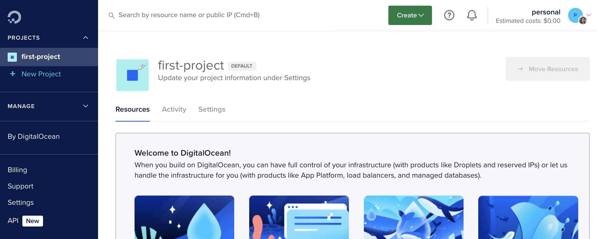
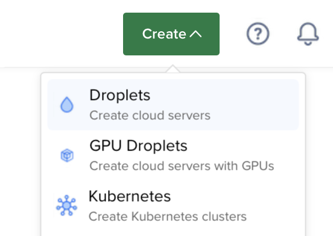
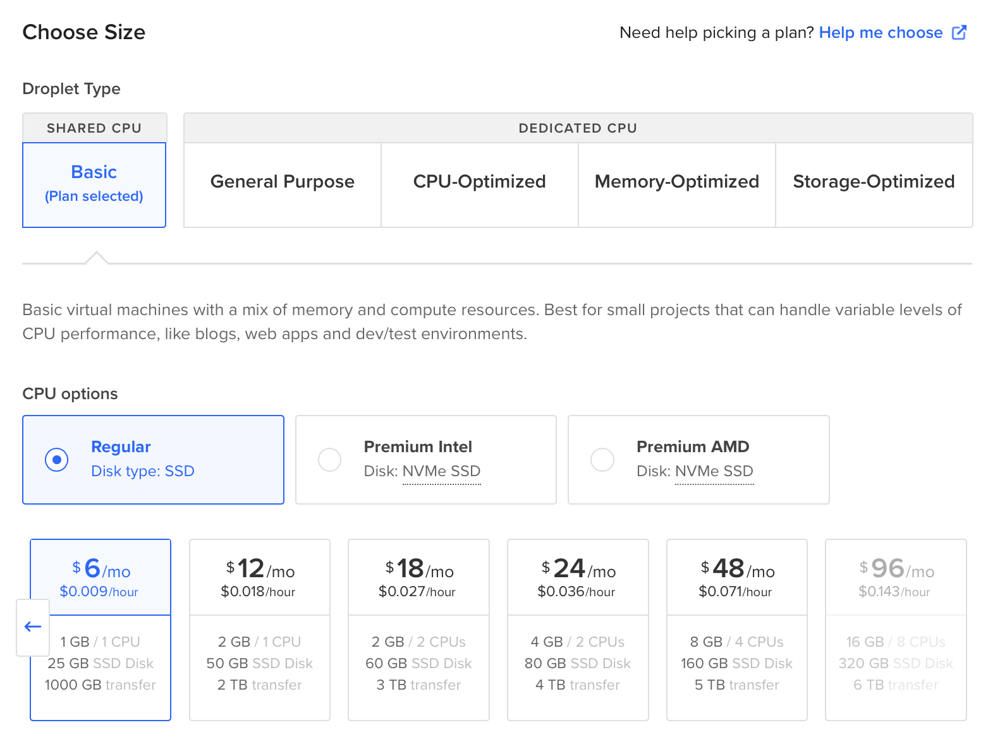

[3] Digital Ocean




- crear una cuenta (necesita medio de pago)

https://m.do.co/c/b117f791b027


- crear droplet
    - elegir imagen RStudio
    
    
    - elegir configuración
    
    
    

- configurar droplet
    - crear usuarios
```
adduser usuario
```

```
adduser usuarioprueba
usermod -aG sudo usuarioprueba
```

- abrir Rstudio: IP:8787


- Clonar una app
    - Nuevo proyecto
    - Proyecto desde control de versiones
    - https://github.com/bastianolea/estimador_ingresos_trabajo.git

- Enlazar proyecto con la carpeta de shiny-server
```
sudo ln -s ~/miaplicacion /srv/shiny-server/
```

- Instalar paquetes para Shiny
Desde la consola de Digital Ocean:
```
sudo su - shiny
R
install.packages("...")
```

- Editar configuración de Shiny
```
sudo nano /etc/shiny-server/shiny-server.conf
```
Dentro de este archivo, agregar estas opciones:
```
preserve_logs true;
sanitize_errors false;
```

Guardar usando control+O, cerrar usando control+W.

