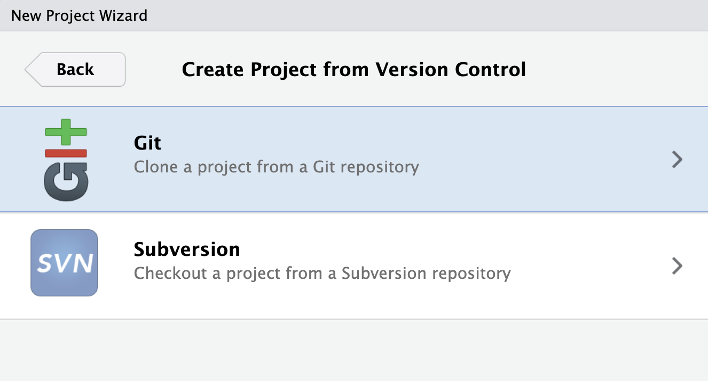
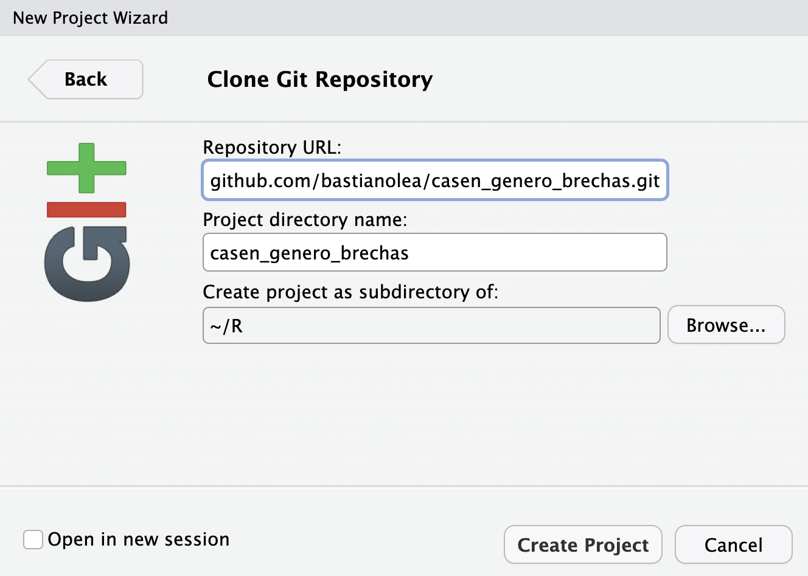

En este tutorial se entregan los pasos para empezar a usar git con tus proyectos de R, meddiante la creación de repositorios git. git te permite llevar un registro de las versiones y un control de cambios en tu código, mientras que GitHub te permite subir tus repositorios a un servicio online, en el cual puedes compartir tu código con otras personas y colaborar en un mismo proyecto.


### Diferencia entre git y GitHub

## Crear una cuenta GitHub
- crear cuenta github
https://github.com

```
install.packages("usethis")
```

## Clonar un repositorio de R





https://github.com/bastianolea?tab=repositories


## Crear un repositorio local para tu proyecto de R
instalar git
https://git-scm.com/downloads

configurar
    
En terminal:
```
git config --global user.name "bastianolea"
git config --global user.email bastianolea@gmail.com
```

`usethis::use_git()` #crear repositorio local


## Crear un repositorio remoto en GitHub para tu proyecto de R


`usethis::create_github_token()` #abre ventana de github, generar y copiar token

`gitcreds::gitcreds_set()` #ingresarle el token

`usethis::use_github()` #crear repositorio remoto y conectarlo con el local


Recursos
https://happygitwithr.com