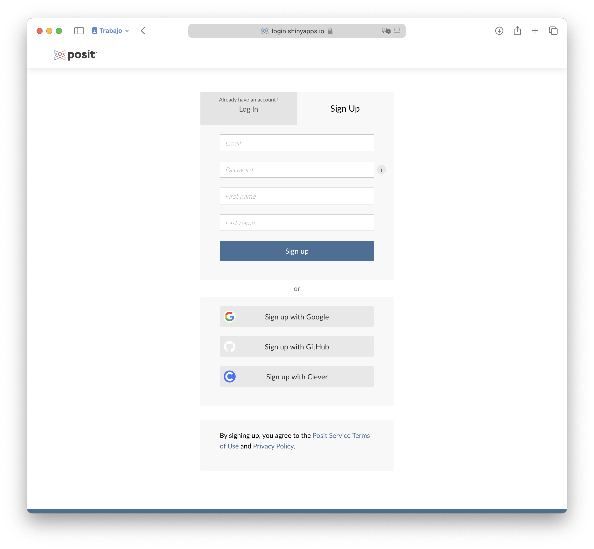
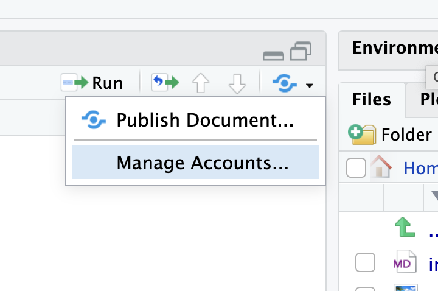
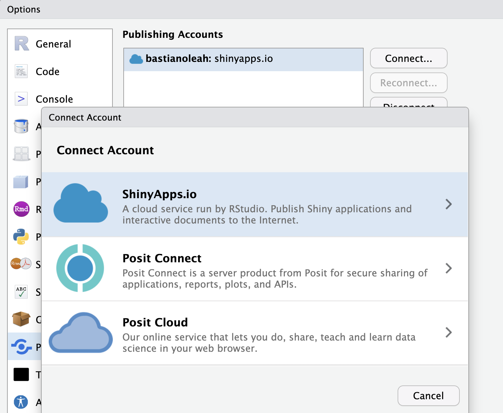

- Crear una cuenta en ShinyApps.io
https://www.shinyapps.io

- Las cuentas gratuitas permiten tener hasta 5 aplicaciones, con 25 horas de uso mensual (en total, entre todos tus usuarios)
- El plan inicial (13USD) permite 25 aplicaciones y 1000 horas de uso mensual.



Instalar el paquete {rsconnect}

```
install.packages('rsconnect')
```
Autorizar tu cuenta de ShinyApps.io en RStudio.
Para ello, shinyapps te entrega un código secreto asociado a tu cuenta, el cual debes registrar en tu sesión de R


```
rsconnect::setAccountInfo(name=‘cuenta’,
			  token=‘<TOKEN>,
			  secret='<SECRET>')
```


Botón _publicar_


Agregar cuenta 


Copiar y pegar en el panel


En el script de tu aplicación Shiny, presiona el botón azul de Publicar
Selecciona los archivos a incluir, tu cuenta, y el nombre de la aplicación
Presiona Publicar

