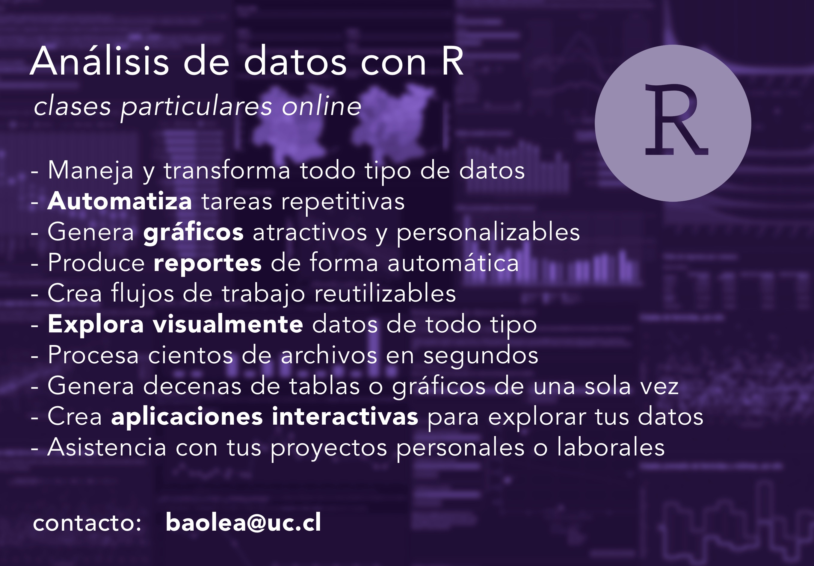

[**Contáctame para agendar una clase particular**](/contact/), indicando tu experiencia con R (puede ser aprender desde cero), los temas que te interesan, y/o el proyecto que desees realizar.

R es un lenguaje de programación enfocado en el análisis de datos y la presentación de datos y resultados, ya sea por medio de gráficos, tablas, o aplicaciones interactivas. Es un lenguaje de programación ampliamente usado en estadísticas, ciencias sociales, ciencias naturales, geografía y más.

Se caracteriza por ser amigable y fácil de aprender, ya que se su uso se dirige a usuarios variados y no-expertos.

¿Realizas tareas repetitivas sobre datos?
¿Tienes datos pero no les sabes sacar provecho?
¿Necesitas aprender a explorar tus datos?
¿Quieres presentar tus datos o resultados de forma atractiva y/o interactiva?

* Maneja y transforma todo tipo de datos
* Automatiza tareas repetitivas
* Genera gráficos atractivos y personalizables
* Produce reportes de forma automática
* Crea flujos de trabajo reutilizables
* Explora visualmente datos de todo tipo
* Procesa cientos de archivos en segundos
* Genera decenas de tablas o gráficos de una sola vez
* Crea aplicaciones interactivas para explorar tus datos

- Introducción general a R
    - Ideas generales del lenguaje
    - Paquetes
    - Conociendo Tidyverse

- Exploración básica de datos
    - Importación de planillas Excel
    - conocer cómo se estructura la base
    - explorar sus atributos, variables, casos, etc.
    - tipos de datos en R (integers, caracteres, factores)

- Análisis descriptivo de los datos
    - medidas de tendencia central
    - contar casos
    - calcular porcentajes

- Operaciones de limpieza y ordenamiento de datos
    - convertir variables
    - producir nuevas columnas (mutate)
    - limpiar (replace, if_else, na_if, replace_if)
    - trabajar con factores (forcats)
    - unir bases de datos (x_join)

- Transformación de estructuras de datos y manipulación avanzada
    - estructura de datos (pivot_x)
    - producir nuevas variables (case_when)
    - corregir datos (stringr)

- Visualización básica
    - introducción a ggplot2

- Visualización intermedia
    - distintos tipos de gráficos
    - gráficos con facetas
    - personalizar gráficos

- Visualización de datos comunales o regionales en mapas, nivel básico
    - paquete chilemapas
    - coincidir datos geográficos
    - ggplot2 para visualización georeferenciada

- Introducción al análisis de texto
    - contabilizar palabras, líneas, párrafos
    - filtrar palabras irrelevantes
    - analizar frecuencias de términos (count, tf_idf)
    - graficar datos textuales

- Elaboración de reportes
    - introducción a RMarkdown
    - insertar datos y gráficos a documentos
    - personalizar reportes

- Elaborar aplicaciones interactivas
    - introducción a Shiny
    - elaborar una aplicación de visualización básica
    - implementar interactividad

Temas avanzados:
- Visualización de mapas y datos georeferenciados
- Web scraping para obtención de datos desde la web
- Análisis de texto
- Automatización de reportes
- Desarrollo de aplicaciones interactivas

[**Contáctame para agendar una clase particular**](/contact/)