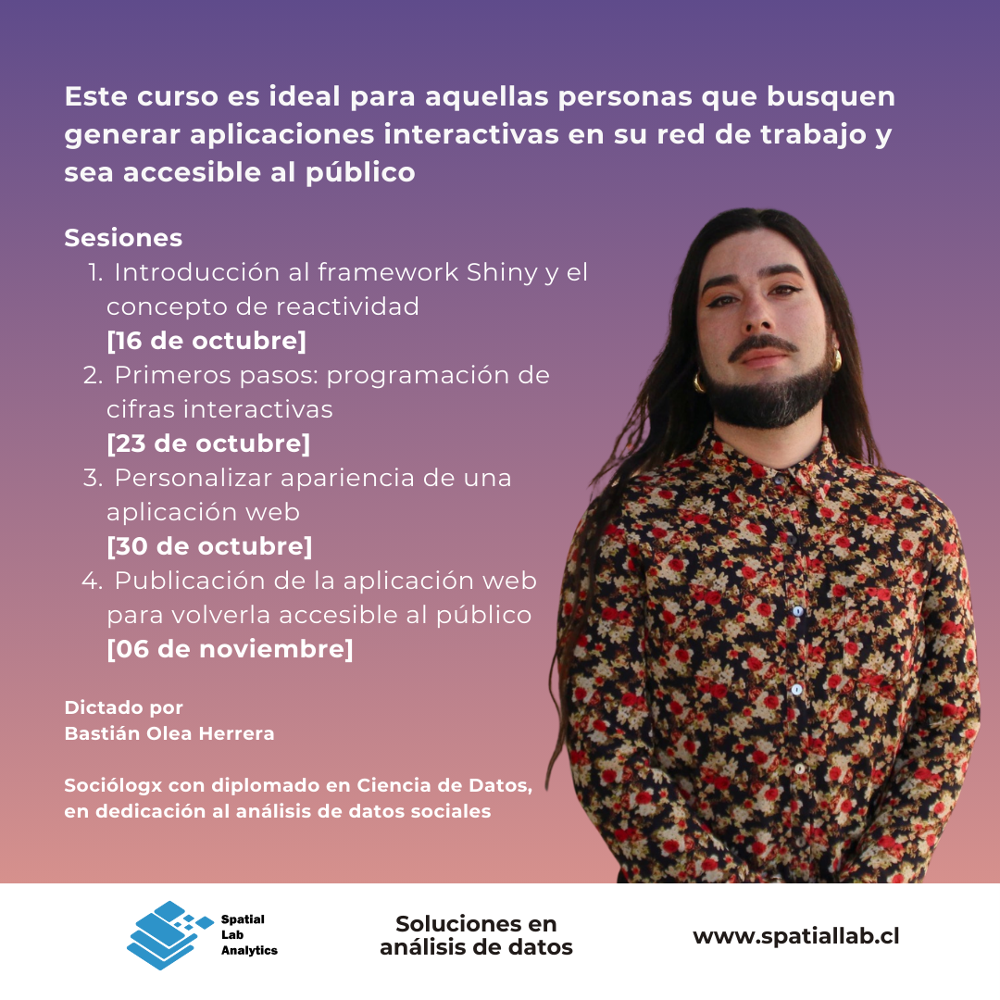

_Temario:_

1. Introducción al framework Shiny y el concepto de reactividad [16 de octubre]
2. Primeros pasos: programación de cifras interactivas [23 de octubre]
3. Personalizar apariencia de una aplicación web [30 de octubre]
4. Publicación de la aplicación web para volverla accesible al público [06 de noviembre]

