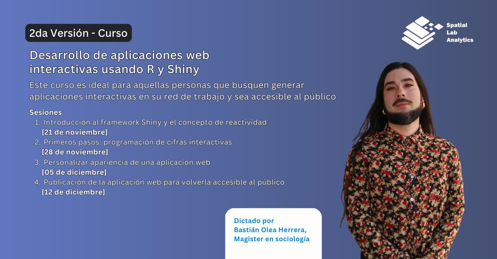

[**Inscripciones aquí**](https://spatiallab.cl/cursos-1/ola/services/2da-version-curso-desarrollo-de-aplicaciones-web-interactivas-usando-r-y-shiny)

Debido al gran interés, se realizará una segunda versión del curso Desarrollo de aplicaciones web interactivas usando R y Shiny dictado por Bastián Olea Herrera, Magíster en Sociología.  [SÓLO 25 CUPOS]  El curso consta de 8 horas cronológicas, divididas en cuatro sesiones de dos horas de duración. Todos los jueves a las 19:00 hrs (GMT-3), desde el 21 de noviembre hasta el 12 de diciembre.  Opciones de pago  - Curso completo: $68.000 pesos chilenos (78 USD). Una vez realizada la reserva, te llegará un correo con las opciones de pago que ofrecemos. 

IMPORTANTE: El pago asegura el cupo de la clase y la reserva caduca en 48 horas. Si no has realizado el pago dentro de las 48 horas, tu cupo se eliminará y pasará a otra persona.  Para dudas y consultas, enviar un correo a contacto@spatiallab.cl 

Este curso es ideal para aquellas personas que busquen generar aplicaciones interactivas en su red de trabajo y sea accesible al público.

_Temario:_

1. Introducción al framework Shiny y el concepto de reactividad [21 de noviembre]  
2. Primeros pasos: programación de cifras interactivas [28 de noviembre]  
3. Personalizar apariencia de una aplicación web [05 de diciembre]  
4. Publicación de la aplicación web para volverla accesible al público [12 de diciembre]

Dictado por  Bastián Olea Herrera, Magister en sociología